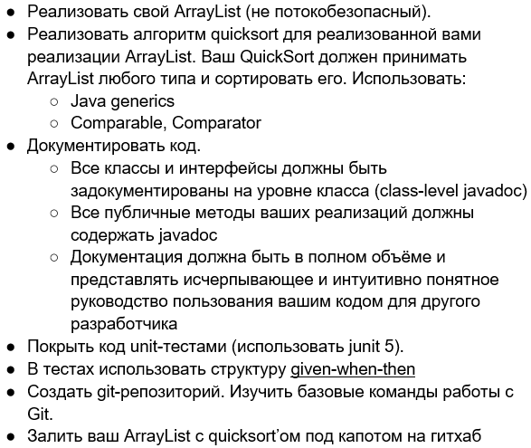

# Custom ArrayList<>()

Домашнее задание на стажировке в компании Aston.

Выполнено в полном объёме. Как такового метода main или другого способа вводить/выводить данные нет. Правильность
работы всех методов проверяется при помощи JUnit-тестов.